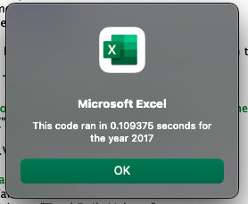
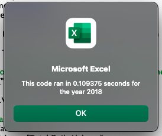

# VBA of Wall Street Stock Analysis Challenge
##  Purpose of Challenge
The prupose of this challenge was to edit or refactor our original code from the module excercise so that it works more efficently as it analyzise all the data from the worksheets. We would know that this is accomplished by comparing the run times from the first version of code from the module and the results from the run time after the code has been refactored for the challenge. The data that we will be analyzing will be from two worksheets with stock activity for 12 companies from two different years (2017 & 2018). 

## Results
After running the analysis for 2017 and 2018, the results show that the selected stocks in 2017 had much better returns for the year, except for ticker TERP. Versus 2018, where 10 out of the 12 companies ended the year with negative returns.  In addition to anlyzing the stock performace, this challenge also wanted to analyze the code performace by timing how long it takes to run.  After refactoring the code so that it can run more effiecntly, the timer pop up window did show that the code did in fact work faster than the original.  The run time results in the orginal code were coming in at approximately 0.65 seconds, while the new code results are around 0.109 seconds.  A significate decrease.  The screenshots below show the new run times of the refactored code. 

 

## Summary
### Advantages and disadvantages of refactoring code
The advantages of refactoring is trying to make code work more efficently.  By doing so, it helps make the code more clearner, organized, and with less steps to process.  This benefits users by making it easier to read and follow.  In addition, it also allows the computer to process the code faster.

Disadvantages to refactoring could be that a user inadvertnily adds changes in the wrong place of the code.  This could create errors if certain steps are out of sequance.  Additional dissadvantages could be while making changes, lines of code could be duplicated when copying and pasting or sections of code could be entirely erased by mistake.  It's usually best to test the changes with every change made to check that everything is working properly and to catch the mistakes early.   

### Advantages and disadvantages of the original and refactored VBA script
The advantage of the refactored code was that it did run faster than the orginal.  The refactored code cleans up the clutter, is better organized and works more effciently.  In addition, it is easier to understand and manage.
